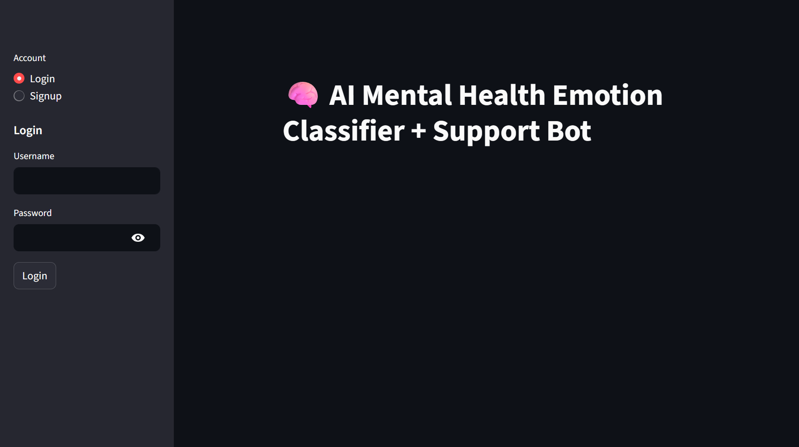
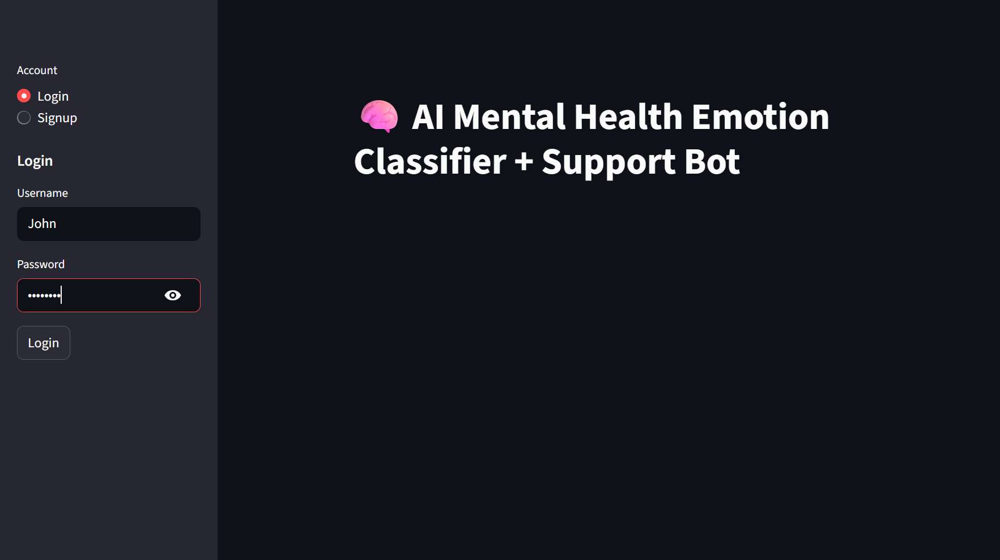

# 🧠 AI Mental Health Emotion Classifier & Support Bot

A lightweight, privacy-first Streamlit web app for emotion detection, journaling, and personalized self-care suggestions using NLP and ML.

> 🎯 Built using: Python · Streamlit · SentenceTransformer · Logistic Regression · Matplotlib · Plotly

---

## ✅ Features

- 🔐 User login/signup with secure password hashing
- 🧠 Emotion detection via SentenceTransformer embeddings + ML classifier
- 📓 Journaling system with entry logs
- 📈 Mood visualization: pie, bar, line, calendar views
- 💡 Personalized self-care tips based on mood

---

## 🔍 How It Works

### 1️⃣ Authentication
- Users can **sign up and log in** securely.
- Passwords are hashed using **SHA256**.
- All user credentials are stored in `users.json`.

---

### 2️⃣ Emotion Detection
- Uses `sentence-transformers/all-MiniLM-L6-v2` to generate **sentence embeddings**.
- A trained **Logistic Regression** model classifies text into 6 core emotions:
  - 😊 **Joy**
  - 😢 **Sadness**
  - 😠 **Anger**
  - 😨 **Fear**
  - 😲 **Surprise**
  - ❤️ **Love**

---

### 3️⃣ Mood Visualization
- Each emotion prediction is stored with a timestamp in `mood_log.csv`.
- The app provides visual insights using:
  - 🥧 **Pie Chart**
  - 📊 **Bar Graph**
  - 📈 **Line Graph**
  - 📅 **Plotly Calendar Heatmap**

---

### 4️⃣ Journaling
- Users can maintain a personal journal.
- Each journal entry includes:
  - 📝 Title
  - 💭 Note
  - 🕒 Timestamp
- Entries are saved in `journal_log.csv` and displayed in expandable views.

# Output

### 🔐 Authentication

Users can sign up and log in securely. Passwords are hashed using SHA256 and stored in `users.json`.

 

### 🎯 Emotion Detection

Uses `sentence-transformers/all-MiniLM-L6-v2` to classify text into 6 core emotions using Logistic Regression.

